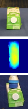

# BioInspiredGrasping

# Introduction
### **Please don't spread this repository online before our paper is published.**

## Abstract


## Pipeline of the proposed grasping method with a bio-inspired soft gripper


## Pipeline of the grasp simulation and dataset collection


## Architecture of the BIG-Net

Note: The 3-layer encoder is composed of a 128-channel CNN with the 9*9 kernel, a 64-channel CNN with the 3*3 kernel and a 32-channel CNN with the 3*3 kernel. The decoders are defined with the same parameters by reverse order.

## Extra explanation
1) This repository has been tested on Ubuntu 16.0 (python 3.6) and Ubuntu 20.0 (python 3.8), and the following tutorial is based on Ubuntu 20.0 (python 3.8).
2) **Please don't spread this repository online before our paper is published.**

# Video demo
1. XXXXX
2. XXXXX

# Tutorials
## Train a neural network
1. Here we provide a brief training demo based on a mini dataset with 1100 grasp scenes. Please download the mini dataset [here](https://drive.google.com/file/d/1wgebzLysjiRvTKFYzGxK5WXHmKob4DKu/view?usp=sharing).

2. Unzip the mini dataset and copy them into the path `$HOME/chameleon_grasp_dataset_released/`.  
    
3. Launch the visualization webpage:
    ```bash
    python -m visdom.server -port 5251 -env_path `$HOME/BioInspiredGrasping/BIG_Net/data
    ```
4. Open your web browser, and visit the webpage below to monitor the training progress:
    ```bash
    http://localhost:5251/
    ```

5. Start training:
    ```bash
    cd $HOME/BioInspiredGrasping/BIG_Net
    python 00_network_training_rt_data_C128_R3.py
    ```

# Robotic Grasping
Here are four expamles of robotic grasping evaluated via the BIG-Net.

   


### Extra tips for neural network training

1. A backup [link](https://XXXXXXXXXXXXXX) to download our mini dataset.

# Citation
## **Will be available soon. Please don't spread this repository online before our paper is published.**
